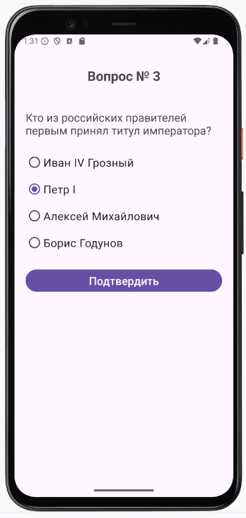

# Домашнее задание по теме "Radio Button"

### Приложение «Я историк»

Написать приложение – викторину(квиз). Пользователю нужно отвечать на пять вопрос по истории Отечества. За каждый правильный ответ он получает максимальное количество баллов, допустим 100. В итоге по окончании игры суммарно он наберет общее количество баллов, за все правильные будет 500. По итогам игры он получает качественную характеристику, как знатока истории.

В приложении необходимо создать:
1. Главный экран с названием викторины и кнопкой «Начать». По нажатию на кнопку выполняется переход на экран с вопросом.

2. Второй экран, на котором в заголовке находится первый вопрос по истории (вопросы нужно придумать самому). Есть три варианта ответа, один из них только правильный. Это нужно передать в RadioButton. В зависимости от выбора пользователя за правильный ответ начисляется 100 баллов, за неправильный – 0 баллов. Количество заработанных баллов сохраняется в переменную result и для общего учета передается через Intent на следующий экран со следующим вопросом и ответами. Т.е. по выбору RadioButton выполняется переход на следующий экран и передаются заработанные баллы.

3. Второй пункт будет повторяться по количеству созданных вопросов, мы с Вами решили, что их будет 5. Переменная result все время суммируется и передается.

4. На последнем экране(ResultActivity) выводится общее количество баллов и краткая характеристика знатока.

5. Текст характеристик нужно придумать, сохранить и в зависимости от общего результата представлять. Уровень знаний, например, можно оценить, как отличный, хороший, удовлетворительный, неудовлетворительный и плохой.

Приложение необходимо сохранить проектом в удаленном репозитории, для проверки качества предоставить ссылку преподавателю, либо сделать скрины эмулятора при каждом шаге работы приложения.

### Скриншоты по домашнему заданию

Скриншоты тута

